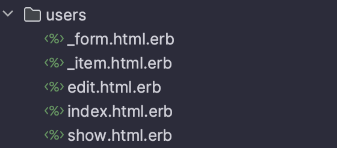

# Admin Panel

All controllers for admin panel extends **Admin::CrudController** class. This class provides basic CRUD actions for models.
Template for this class is located in **app/controllers/admin/crud_controller.rb**:

```ruby
class Admin::CrudController < Admin::AdminController
  before_action :set_class_name
  before_action :set_entity, only: %i[show edit update destroy]

  def index
    @q = Kernel.const_get(@class_name).order(id: :desc).ransack(params[:q])
    @entities_count = @q.result.count
    @entities = @q.result.page(params[:page]).per(params[:per_page])
  end

  def show; end

  def new
    @entity = Kernel.const_get(@class_name).new
  end

  def edit; end

  def create
    @entity = Kernel.const_get(@class_name).new(entity_params)
    if @entity.save
      redirect_to url_for(action: :edit, id: @entity.id), notice: "#{@class_name} was successfully created."
    else
      render :new
    end
  end

  def update
    if @entity.update(entity_params)
      redirect_to url_for(action: :show, id: @entity.id), notice: "#{@class_name} was successfully updated."
    else
      render :edit
    end
  end

  def destroy
    if @entity.destroy
      redirect_to url_for(action: :index), notice: "#{@class_name} was successfully deleted."
    else
      redirect_to request.referer, notice: @entity.errors.full_messages
    end
  end

  private

  def set_class_name
    raise 'method missing'
  end

  def set_entity
    @entity = Kernel.const_get(@class_name).find(params[:id])
  end

  def entity_params
    raise 'method missing'
  end
end
```

How it will look like for **Admin::UsersController**:

```ruby
class Admin::UsersController < Admin::CrudController

  private

  def set_class_name
    @class_name = 'User'
  end

  def entity_params
    params.require(:user).permit(:email, :first_name, :last_name, :phone)
  end
end
```

**AdminController** contains authorization logic for admin panel and reference to layout file. If you need to add some logic to all controllers in admin panel, you can add it to **AdminController**.

```ruby
class Admin::AdminController < ActionCtroller::Base
  protect_from_forgery with: :exception

  before_action :auth_admin
  before_action :set_sentry_context

  layout "appstack"

  private

  def auth_admin
    warden.authenticate! scope: :admin
  end

  def set_sentry_context
    Sentry.set_user(id: current_admin.id, email: current_admin.email)
    Sentry.set_extras(params: params.to_unsafe_h, url: request.url)
  end
end
```

For search we are using [Ransack](https://activerecord-hackery.github.io/ransack/) gem. For pagination we are using [Kaminari](https://github.com/kaminari/kaminari) gem in existing projects, [Pagy](https://github.com/ddnexus/pagy) in latest and new ones. Authorization is done with [Devise](https://github.com/heartcombo/devise) gem.

For templates we are using [AppStack](https://appstack.bootlab.io/docs-introduction.html) bootstrap template. This template is not available in public, so ask your team lead to get access to it. If you've setup project from company template, you already have access to it.

You can find all views in **app/views/admin** folder. Common structure for views looks like this:



We reuse **_form.html.erb** partial in **new** and **edit** views. Partial **_item.html.erb** describes row in table located in **index.html.erb** view. For example, each entrance of **User** model in table will be described as:
```html
<tr class="odd">
  <td><%= entity.id %></td>
  <td><%= entity.email %></td>
  <td><%= entity.full_name %></td>
  <td><%= entity.country %></td>
  <td><%= entity.created_at %></td>
  <td><%= render 'admin/shared/actions', entity: entity %>
</tr>
```

and **actions** will look like this:
```html
<div class="btn-group visible-lg">
  <%= link_to url_for(controller: entity.model_name.plural, action: :show, id: entity.id),
              class: 'btn btn-xs btn-primary', title: "Open #{entity.class.name}" do %>
    <i data-feather="eye"></i>
  <% end %>

  <%= link_to url_for(controller: entity.model_name.plural, action: :edit, id: entity.id),
              class: 'btn btn-xs btn-warning', title: "Edit #{entity.class.name}" do %>
    <i data-feather="edit"></i>
  <% end %>

  <%= link_to url_for(controller: entity.model_name.plural, action: :show, id: entity.id),
              class: 'btn btn-xs btn-danger', method: :delete,
              data: { confirm: 'Are you sure ?' }, title: "Remove #{entity.class.name}" do %>
    <i data-feather="trash"></i>
  <% end %>
</div>
```

## References
- https://appstack.bootlab.io/docs-introduction.html
- https://activerecord-hackery.github.io/ransack
