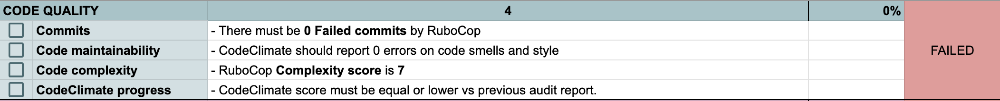
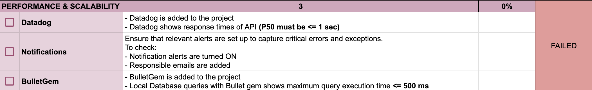
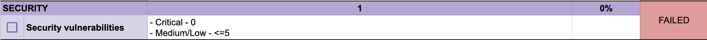
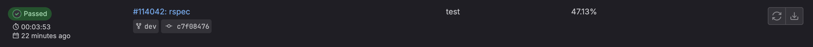
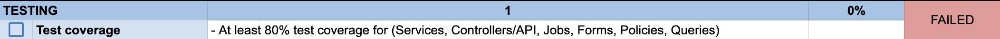
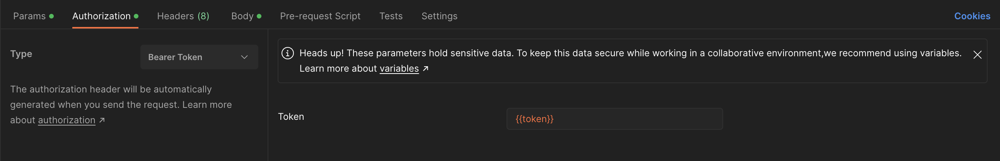
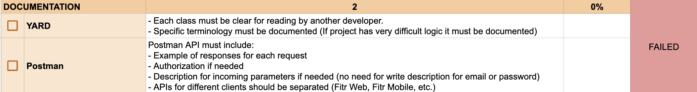
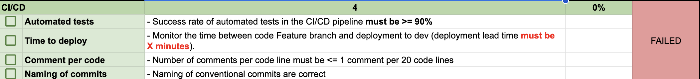
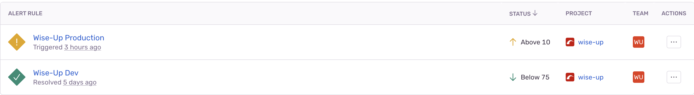
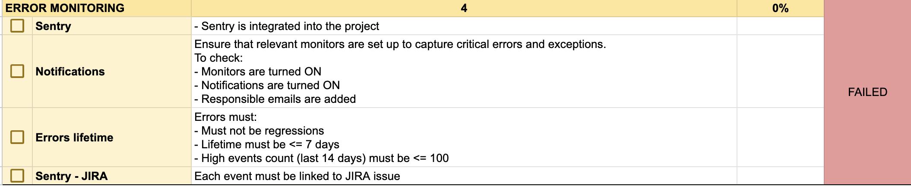

# Backend Audit

- [Code Quality](#code-quality)
- [Performance](#performance)
- [Security](#security)
- [Testing](#testing)
- [Documentation](#documentation)
- [CI/CD](#cicd)
- [Error monitoring](#error-monitoring)


The purpose of a backend audit is to ensure that the backend of a software application is functioning properly and efficiently. It involves reviewing the code quality, performance, and security of the backend system.

__________________________

### Code Quality

This section of audit is related to **code quality**. [CodeClimate](https://docs.gitlab.com/ee/ci/testing/code_quality.html) is a tool that analyzes code and detects issues such as bugs, vulnerabilities, and code smells. It helps to maintain code quality and improve the overall health of the codebase. In order to pass the code quality check, the code must have 0 code smells.

Example of `.codeclimate.yml` for the project:

```yaml
checks:
  argument-count:
    enabled: false
  file-lines:
    enabled: false
  method-complexity:
    config:
      threshold: 7
  method-count:
    enabled: false
  method-lines:
    enabled: false
plugins:
  brakeman:
    enabled: true
  bundler-audit:
    enabled: true
  fixme:
    enabled: true
  rubocop:
    enabled: true
    channel: rubocop-1-48-1
ratings:
  paths:
    - 'app/**'
    - 'lib/**'
exclude_paths:
  - 'config/'
  - 'db/'
  - 'public/'
  - 'spec/'
  - 'vendor/'
```

You need to specify version of **rubocop** in `channel` property from your **Gemfile.lock**, otherwise you will get an error. We disable some checks because they repeat the same checks from **rubocop**. Also we exclude some folders from checking because they are not related to our codebase. You can find more information about configuration in [CodeClimate documentation](https://docs.codeclimate.com/docs/configuring-your-code-climate-analysis).

We generate CodeClimate report in Gitlab CI. To do this, add the following lines to `.gitlab-ci.yml`:

```yaml
include:
  - template: Code-Quality.gitlab-ci.yml

code_quality_html:
  extends: code_quality
  variables:
    REPORT_FORMAT: html
  artifacts:
    paths: [gl-code-quality-report.html]
  when: manual
  rules:
    - if: '$CI_COMMIT_REF_PROTECTED == "true"'
```

Then you can find CodeClimate report in `code_quality_html` pipeline artifacts and download it.



__________________________

### Performance

The section of audit is related to applicaiton performance. [Datadog](https://www.datadoghq.com/blog/monitoring-rails-with-datadog/) is a monitoring tool that helps to identify performance issues in real-time. It can be used to track metrics such as response time, throughput, and error rates. The requirement of requests not exceeding 1s in pt50 is a performance metric that ensures that the backend system is responding quickly to user requests. The [Bullet](https://github.com/flyerhzm/bullet) gem is used to detect slow database queries and improve performance in development and test environments.



__________________________

### Security

This section of audit is related to application security. We need to ensure that our users' data are properly protected. [Brakeman](https://brakemanscanner.org/) is a security scanner that checks for security vulnerabilities in Ruby on Rails applications. It helps to identify potential security breaches and provides recommendations for fixing them. The requirement of having 0 critical issues and <5 low or medium issues ensures that the backend system is secure and protected from potential attacks.



__________________________

### Testing

This section of audit is related to **testing**. [SimpleCov](https://github.com/simplecov-ruby/simplecov) is a code coverage analysis tool that helps to identify untested code and improve test coverage. It can be used to track metrics such as lines of code, branches, and methods. The requirement of having at least 80% test coverage ensures that the backend system is well tested and all code paths are covered by tests. To display coverage report in Gitlab CI, add the following lines to `.gitlab-ci.yml`:

```yaml
rspec:
  extends: .db
  stage: test
  coverage: '/\(\d+.\d+\%\) covered/'
  script:
    - bundle exec rake assets:precompile
    - bundle exec rspec --profile 10 --format progress --format RspecJunitFormatter --out rspec.xml
  artifacts:
    when: always
    paths:
      - rspec.xml
      - coverage/
    reports:
      coverage_report:
        coverage_format: cobertura
        path: coverage/coverage.xml
      junit: rspec.xml
```

Then you can find percentage of test coverage in Gitlab CI pipeline on Jobs tab.



As you see above, we also use Cobertura format for [Test coverage visualization ](https://docs.gitlab.com/ee/ci/testing/test_coverage_visualization.html). To generate Cobertura report, add the following lines to `spec/spec_helper.rb`:

```ruby
require 'simplecov'
require 'simplecov-cobertura'

SimpleCov.start 'rails' do
  add_filter '/bin/'
  add_filter '/db/'
  add_filter '/spec/' # for rspec
  add_filter '/test/' # for minitest

  add_filter '/app/channels/'
  add_filter '/app/models/'
  add_filter '/app/helpers/'
  add_filter '/app/controllers/admin_panel' # it is optional to write tests for admin panel
  add_filter '/app/controllers/concerns/'
  add_filter '/lib/tasks/'

  add_filter do |source_file|
    source_file.lines.count < 20 # skip files with < 20 lines of code
  end

  add_group 'Forms', 'app/forms'
  add_group 'Policies', 'app/policies'
  add_group 'Services', 'app/services'

  formatter SimpleCov::Formatter::MultiFormatter.new([
                                                       SimpleCov::Formatter::HTMLFormatter,
                                                       SimpleCov::Formatter::CoberturaFormatter
                                                     ])
end
```



__________________________

### Documentation

This section is about business logic and API documentation. [YARD](https://yardoc.org/) is a documentation generation tool that helps to create documentation for Ruby on Rails applications. It can be used to generate HTML, PDF, and Markdown documentation from source code comments. The requirement of having all specific business logic documented ensures that the backend system is well documented and easy to understand.

For API documentation we use [Postman](https://www.postman.com/). It is a tool that helps to create and share API documentation. You need to place all requests related to project in one collection, add examples for request when needed and provide description for request parameters that are not self-explanatory. It will help frontend developers to understand how to use API and what to expect from it.

You also need to provide proper `Authorization` if request requires one. In most cases it is `Bearer` token, but sometimes it can be `Basic` or `Digest` authentication. You can find more information about authentication in [Postman documentation](https://learning.postman.com/docs/sending-requests/authorization/).



Please provide `token` variable with valid user token in corresponding Postman environment. It will make faster for other developers to use your collection, because they will not need to create user in advance. You can find more information about environment variables in [Postman documentation](https://learning.postman.com/docs/sending-requests/variables/).



__________________________

### CI/CD

This section is about **CI/CD** configured on project. [Gitlab CI](https://docs.gitlab.com/ce/ci/) is a continuous integration and delivery tool that helps to automate the process of building, testing, and deploying software. It can be used to run tests, generate code coverage reports, and deploy applications to production environments. The requirement of having all tests passing and all code coverage metrics met ensures that the backend system is well tested and ready for deployment.

We need to ensure that all tests are passing and none preventing deployment to dev/staging/production environments. Also we check that commits meet [Conventional Commits](https://www.conventionalcommits.org/en/v1.0.0/) specification. To do this, add the following lines to `.gitlab-ci.yml`:

```yaml
commitlint:
  extends: .base
  stage: lint
  variables:
    NODE_MAJOR: 16
  before_script:
    - curl -sL https://deb.nodesource.com/setup_$NODE_MAJOR.x | bash -
    - apt-get update -qq && DEBIAN_FRONTEND=noninteractive apt-get install -yq --no-install-recommends nodejs
    - npm install -g @commitlint/cli @commitlint/config-conventional
  script:
    - echo "${CI_COMMIT_MESSAGE}" | commitlint

```

Also you need to specify `@commitlint/config-conventional` in `commitlint.config.js`:

```js
module.exports = {
  extends: ['@commitlint/config-conventional'],
};
```

The next thing we need to check is amount of comments in merge request. It is bad sign if merge request has a lot of comments, because it means that code is not clear enough and needs to be refactored.



__________________________

### Error monitoring

This section is about **Error monitoring**. [Sentry](https://sentry.io/) is a tool that helps to monitor errors in Ruby on Rails applications. It can be used to track errors, exceptions, and crashes in real-time. The requirement of having **Sentry** added to project and alerts configured ensures that the backend system is well monitored and all errors are tracked.

You need to create project in Sentry and add `SENTRY_DSN` variable to project either in `.env` or `credentials.yml`. You can find more information about how to do it in [Sentry documentation](https://docs.sentry.io/product/sentry-basics/dsn-explainer/).

Then you need to create separate alerts for each environment. We recommend to create alerts for `critical` and `warning` levels. You should specify all responsible people for each alert (e.g. backend developers, frontend developers, DevOps engineers that are responsible for this project). You can also specify how often you want to receive notifications (e.g. every 5 minutes, every 30 minutes, every hour. You can find more information about how to do it in [Sentry documentation](https://docs.sentry.io/product/alerts-notifications/alerts/).



Also you need to check lifetime of erros on project and make sure that it is less than 7 days. Long lifetime of errors means that you have a lot of errors that are not fixed and it is bad sign. You can use filter `firstSeen:` with `before` and specify a datetime week ago to display list of errors that appeared more than 7 days ago.

Issues must not be regressed. It means that if you fixed an issue, it should not appear again.

All issues need to be tracked in JIRA. It should be done by QA engineer or developer that is responsible for this issue. It is important to add all necessary information to JIRA issue (e.g. steps to reproduce, screenshots, logs, etc.). It will help developers to understand the issue and fix it faster.

